# Lab Report 1 - Week 2

Welcome CSE 15L students! Follow this tutorial to setup your course-specific accounts on `ieng6`.

## Installing VSCode
Let's start with installing Visual Studio Code, the IDE (Integrated Development Environment) that you will be using for this course.
* Go to [Visual Studio Code's website](https://code.visualstudio.com). Then download and install it for your operating system.
* Upon opening VSCode, you should see a window that is similar to the one below.

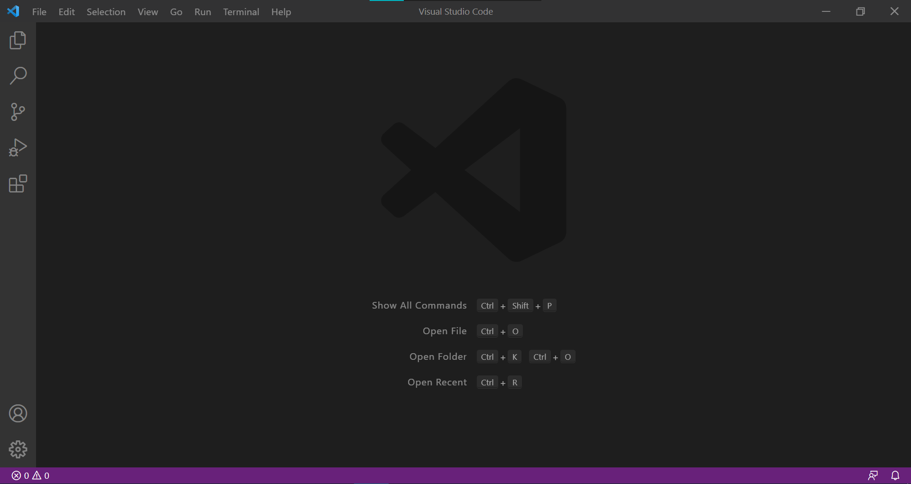

## Remotely Connecting
In CSE 15L, we will be using course-specific accounts to connect to a remote computer. This allows us to work on another computer remotely, which may even be something you do in a future job.
* Start by downloading a program called [OpenSSH](https://docs.microsoft.com/en-us/windows-server/administration/openssh/openssh_install_firstuse) and looking for your course-specific account [here](https://sdacs.ucsd.edu/~icc/index.php).
* Then open a terminal (Terminal → New Terminal) in VSCode and enter the following command, but replace the example account with yours:

`$ ssh cs15lwi22auq@ieng6.ucsd.edu`

* After entering `yes`, you will be prompted for your password, and upon providing it you should now be logged in with this output displayed:

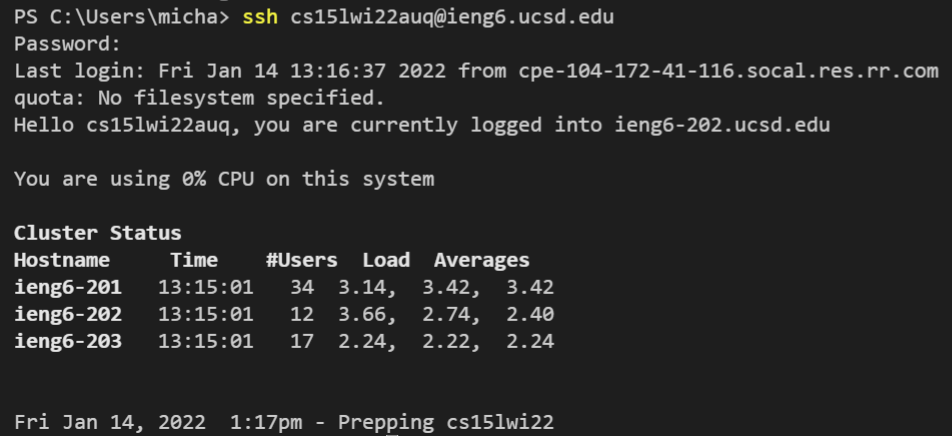 

Now you are logged into a remote computer, which acts as the *server*. Any commands you run on your computer, the *client*, will actually be run on the remote computer via the connection you just established from `ssh`-ing.

## Trying Some Commands
Let's try running some commands like `cd`, `ls`, `cp`, and `pwd`. You may want to try these on your computer first. To log out of the remote computer, enter `exit` into the terminal. After running the commands on the client, `ssh` back into the server and try running those same commands, taking note any differences.

For example, running `mkdir` on the server produces this message. Why did this happen?

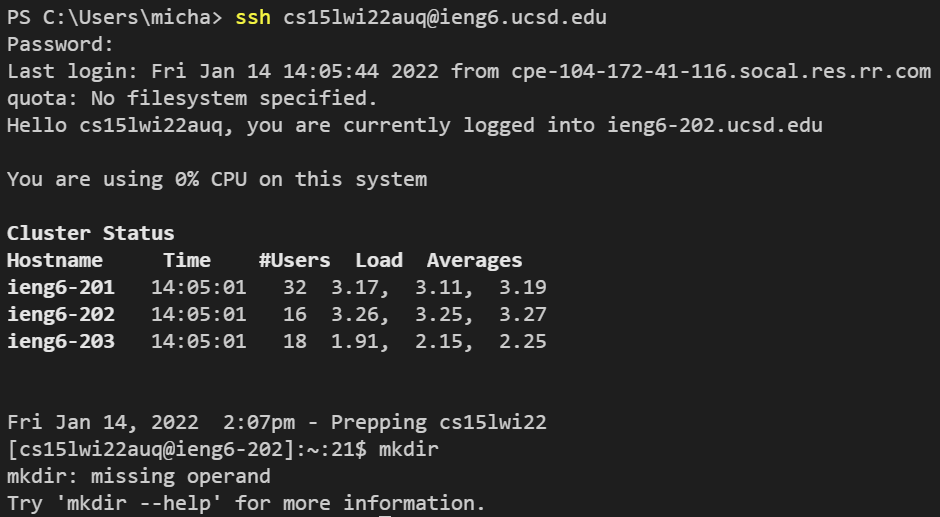

Here is a list of useful commands. Try running them on the server and think about what each one does:
* `cd ~`
* `ls -lat`
* `ls -a`
* `cp /home/linux/ieng6/cs15lwi22/public/hello.txt ~/`
* `cat /home/linux/ieng6/cs15lwi22/public/hello.txt`

## Moving Files with scp
An important component of working remotely with computers is being able to transfer files back and forth from the local and remote computers.

A `scp` command can be run from the client, which allows you to copy one or more files from your computer to a remote computer.

* Try creating a file with a name like `WhereAmI.java` that includes the code below:

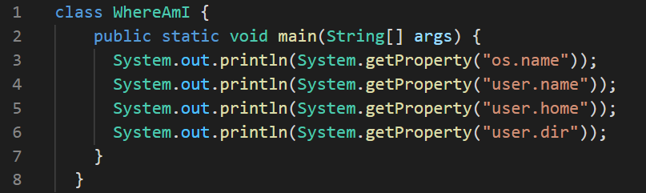

* Now you can run the following command in your directory's terminal:

`scp WhereAmI.java cs15lwi22auq@ieng6.ucsd.edu:~/`

* After entering your password, you should get an output like the one below:

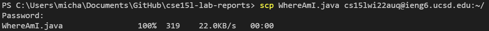

* Try using the `ls` command after `ssh`-ing now. You should see the `WhereAmI.java` file in your home directory. 

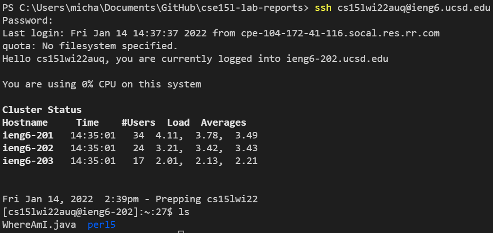

* Using `javac` and `java` commands will give you information about the file on the server, which should be different from what you see on your computer.

**On the server:**
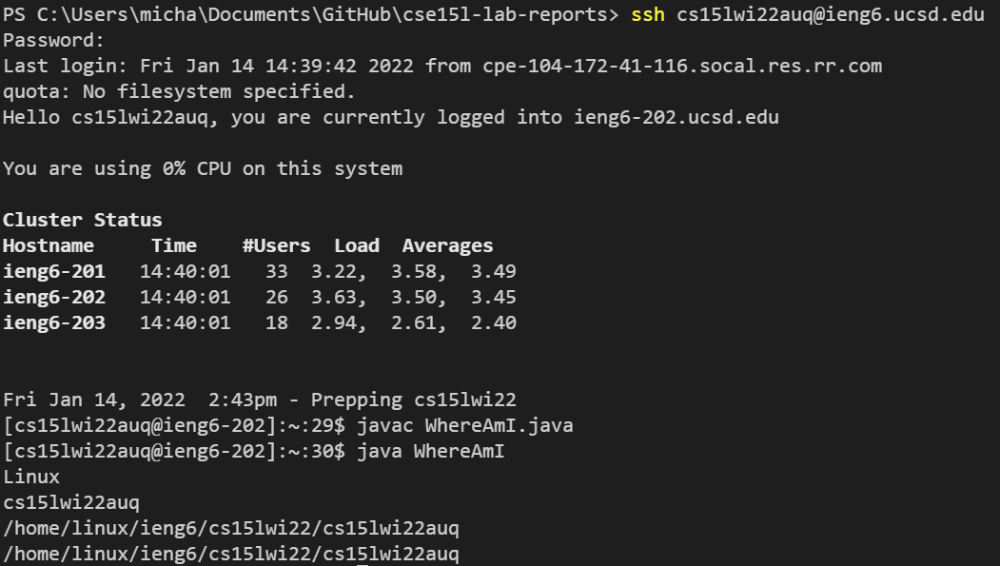

**On the client:**
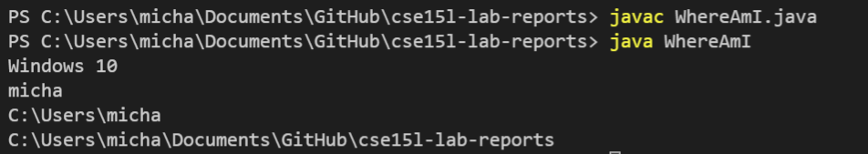

## Setting an SSH Key
When we run `scp`, it can be tedious to reenter our password every time. But, there is a solution for this: `ssh` keys. You can research more about ssh keys [here](https://docs.microsoft.com/en-us/azure/virtual-machines/linux/create-ssh-keys-detailed). 

With ssh keys, a program called `ssh-keygen` generates a pair of files: a *public* key and a *private* key. 

Great. But how does this help? When you use the `scp` command, entering your password can be overriden by using these files. You can copy the public key somewhere on the server and copy the private key somewhere on the client.

* Follow below to create the private key (in a file id_rsa) and the public key (in a file id_rsa.pub), stored in the .ssh directory on your computer.

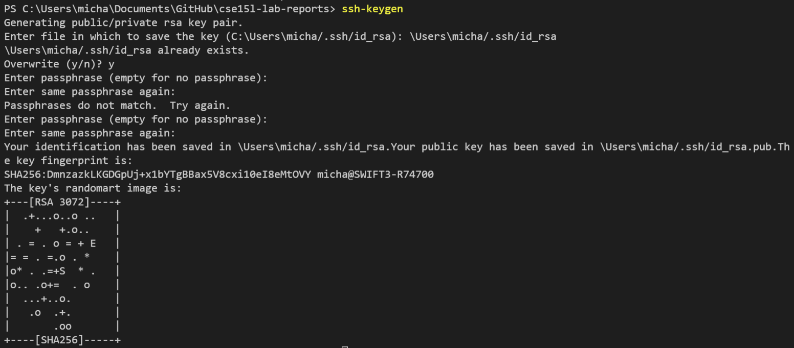

* Next, you copy the *public* key to your account's `.ssh` directory on the server. After `ssh`-ing, enter the following command and logout:

`mkdir .ssh`

* Then `scp` like below:

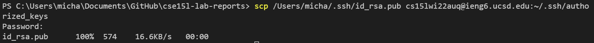

You should now be able to `sch` and `scp` without needing your password.

## Optimizing Remote Running
When editing and saving files, it can become a lengthy process. Try editing `WhereAmI.java` on your computer, and then use `scp` and run it on the remote computer. Here are some tips to speed up the process:

* In the terminal, use the up arrow as many times as needed to get back commands recently used
* Run a command directly on the remote computer  by surrounding it in quotes at the end of a `ssh`

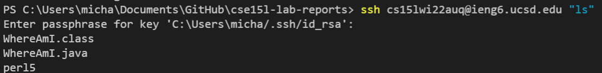

