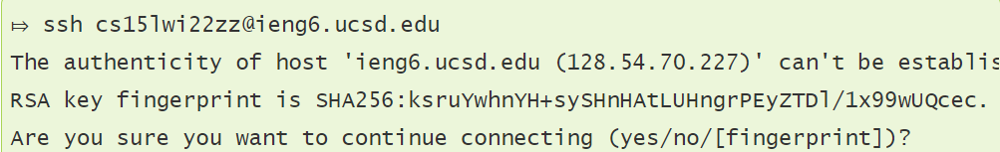

# Lab Report 1 - Week 2

Welcome CSE 15L students! Follow this tutorial to setup your course-specific accounts on `ieng6`.

## Installing VSCode
Let's start with installing Visual Studio Code, the IDE (Integrated Development Environment) that you will be using for this course.
* Go to [Visual Studio Code's website](https://code.visualstudio.com). Then download and install it for your operating system.
* Upon opening VSCode, you should see a window that is similar to the one below.

---

## Remotely Connecting
In CSE 15L, we will be using course-specific accounts to connect to a remote computer.
* Start by downloading a program called [OpenSSH](https://docs.microsoft.com/en-us/windows-server/administration/openssh/openssh_install_firstuse) and looking for your course-specific account [here](https://sdacs.ucsd.edu/~icc/index.php).
* Then open a terminal (Terminal → New Terminal) in VSCode and enter the following command, but replace the example account with yours:

`$ ssh cs15lwi22zz@ieng6.ucsd.edu`
* Connecting to the server for the first time will give you a message similar to the following:

* After entering `yes`, you will be prompted for your password, and upon providing it you should now be logged in with this output displayed:

 

Now you are logged into a remote computer, which acts as the *server*. Any commands you run on your computer, the *client*, will actually be run on the remote computer via the connection you just established from `ssh`-ing.

---

## Trying Some Commands
Let's try running some commands like `cd`, `ls`, `cp`, and `pwd`. You may want to try these on your computer first. To log out of the remote computer, enter `exit` into the terminal. After running the commands on the client, `ssh` back into the server and try running those same commands, taking note any differences.

For example, running `mkdir` on the server produces this message. Why did this happen?

Here is a list of useful commands. Try running them on the server and think about what each one does:
* `cd ~`
* `ls -lat`
* `ls -a`
* `cp /home/linux/ieng6/cs15lwi22/public/hello.txt ~/`
* `cat /home/linux/ieng6/cs15lwi22/public/hello.txt`

