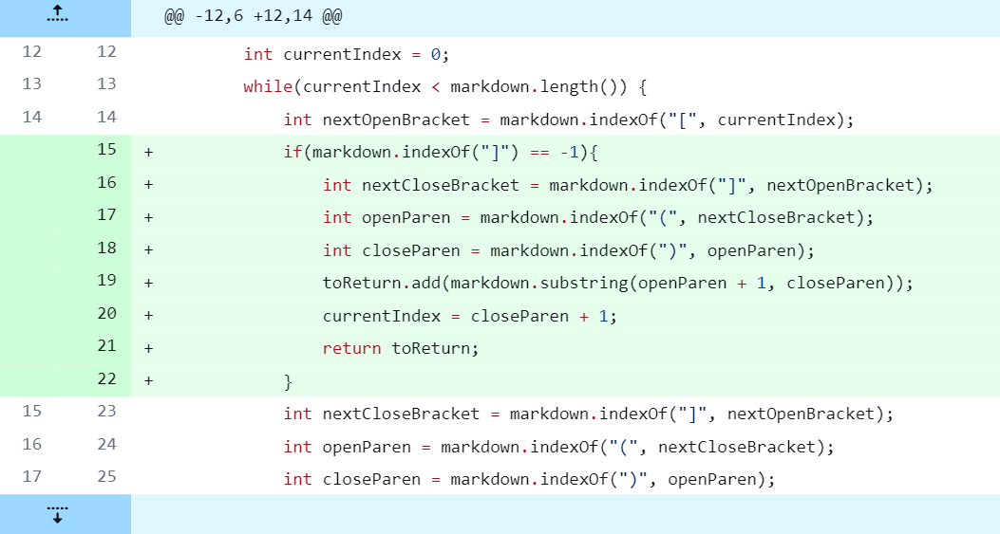
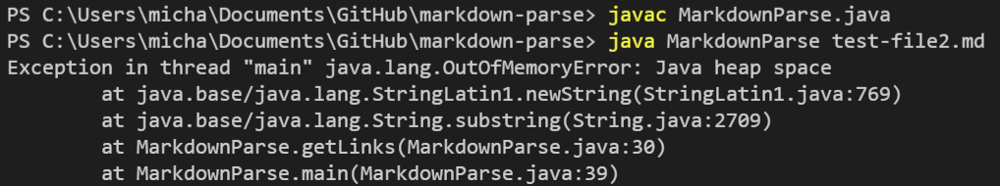

# Lab Report 2 - Week 4

## Code Change 1

This [test file](https://github.com/mtang24/markdown-parse/blob/main/test-file2.md) caused a failure-inducing input that prompted the changes made above.

Before making that change, running the markdown file would result in the following:

**What happened here?**
The test file with the failure-inducing input contained a link that was formatted incorrectly, using a `)` instead of a `]`. This created a bug in `MarkdownParse.java`, as this file was only expecting a close bracket at that index instead of a close parenthesis. As a result, running this code produced a noticeable symptom: an `OutOfMemoryError`.

## Code Change 2

This [test file](https://github.com/mtang24/markdown-parse/blob/main/test-file4.md) caused a failure-inducing input that prompted the changes made above.

Before making that change, running the markdown file would result in the following:

**What happened here?**
The test file with the failure-inducing input contained a link without having both the open parenthesis preceding the link and the close parenthesis succeeding the link. This created a bug in `MarkdownParse.java`, as this file was expecting both an open and close parenthesis required to create the substring that would be added to the ArrayList `toReturn`. As a result, running this code produced a noticeable symptom: a `StringIndexOutOfBoundsException` (due to openParen and closeParen equaling to -1 since `(` nor `)` appeared in the test file).

## Code Change 3

This [test file](https://github.com/mtang24/markdown-parse/blob/main/test-file5.md) caused a failure-inducing input that prompted the changes made above.

Before making that change, running the markdown file would result in the following:

**What happened here?**
The test file with the failure-inducing input contained a link without having any parentheses, instead placing the link between brackets. This created a bug in `MarkdownParse.java`, as this file was expecting both an open and close parenthesis required  to create the substring that would be added to the ArrayList `toReturn`. As a result, running this code produced a noticeable symptom: an empty ArrayList `[]` (since incorrect index values did not permit a substring to be created and added to toReturn).

