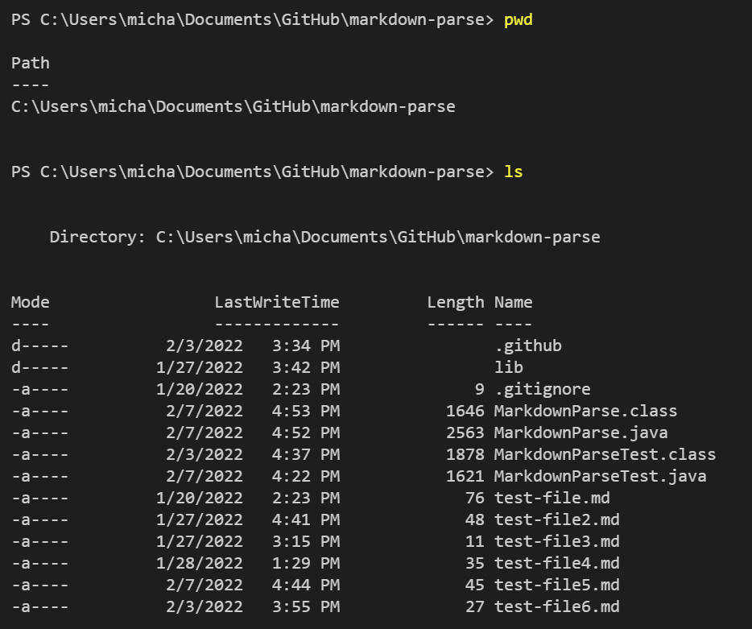
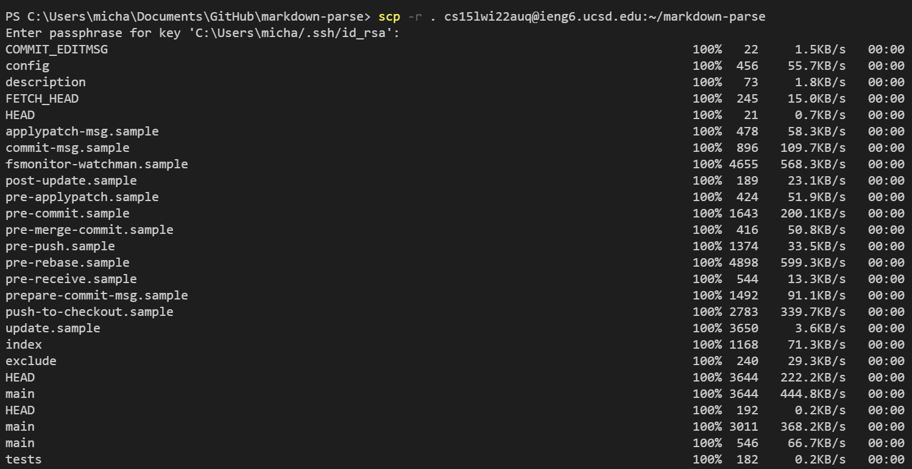
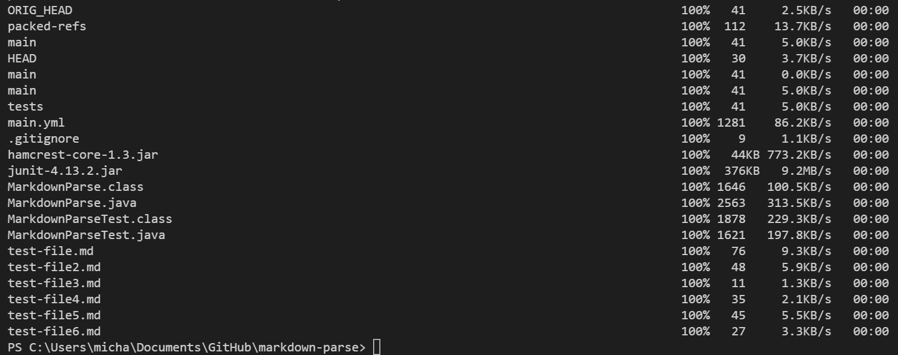
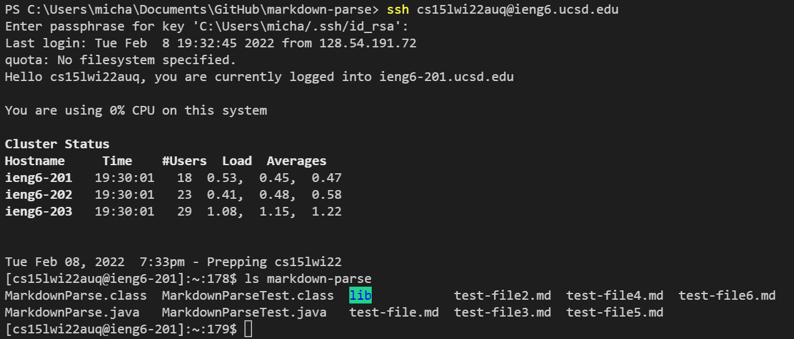
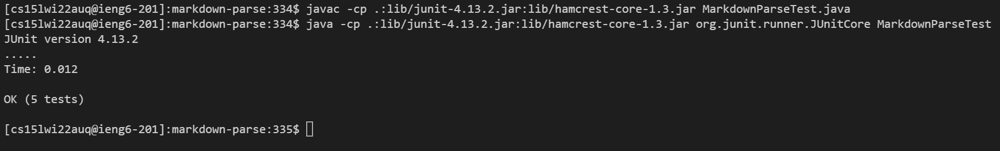
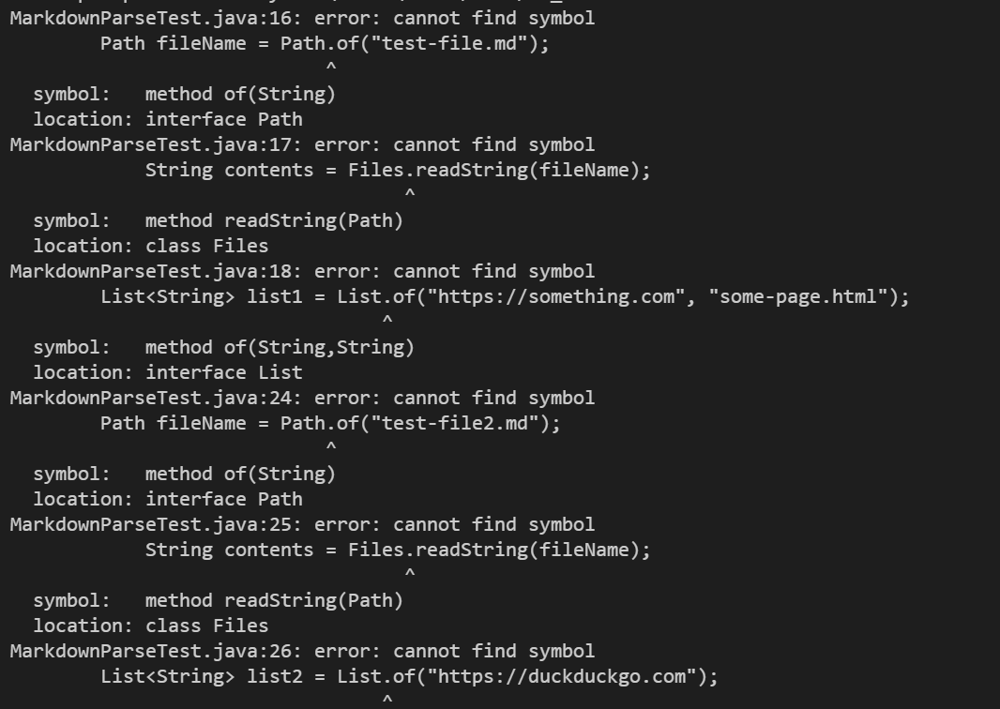
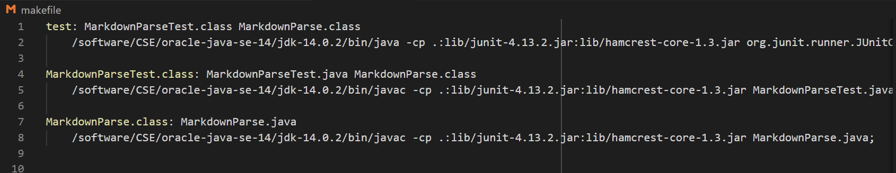
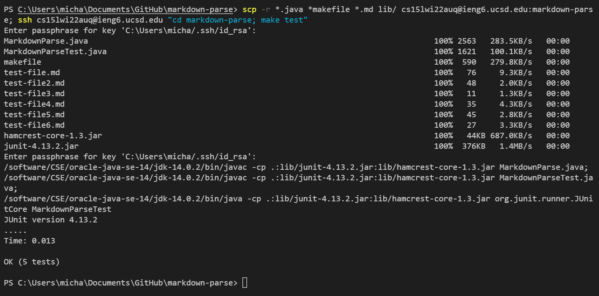

# Lab Report 3 - Week 6

View all my lab reports [here](https://mtang24.github.io/cse15l-lab-reports/)!

---

## Copy Whole Directories with "`scp -r`"

First, we print our working directory using `pwd` and use `ls` to get the list of files in our current directory:

 

I copied this entire markdown-parse directory to my ieng6 course account using

`scp -r . cs15lwi22auq@ieng6.ucsd.edu:~/markdown-parse`

As the screenshot shows, many files were copied, which highlights how much more simplified the later scp command will be.

Now I logged into my ieng6 account and we can verify that the files that I just copied are in a directory in the remote server, using `ls markdown-parse`:

I then proceed to run tests for markdown-parse, and got them to pass. 

However, this took a lot more steps than we would prefer to do. So we can try to use a single line command.

I tried combining `scp`, `;`, and `ssh` in one line using a command like

`scp -r *.java *.md lib/ cs15lwi22auq@ieng6.ucsd.edu:markdown-parse; ssh cs15lwi22auq@ieng6.ucsd.edu "cd markdown-parse; javac -cp .:lib/junit-4.13.2.jar:lib/hamcrest-core-1.3.jar MarkdownParseTest.java; java -cp .:lib/junit-4.13.2.jar:lib/hamcrest-core-1.3.jar org.junit.runner.JUnitCore MarkdownParseTest”`

but I ran into errors: 

This is most likely due to the local computer and the remote server having different versions of Java installed, so paths and files may not be recognized.

To fix this, I needed to configure the command to run the same java version, which was a common problem other students had. We were able to get help from this [Piazza post ](https://piazza.com/class/kxs0toocqhv4og?cid=354).

I also added a `makefile` that we learned from Lab 6 to make running the `javac` commands simpler, and also shorter. Here is a look at that `makefile`, and then the command I ran.

One line command: `scp -r *.java *makefile *.md lib/ cs15lwi22auq@ieng6.ucsd.edu:markdown-parse; ssh cs15lwi22auq@ieng6.ucsd.edu "cd markdown-parse; make test”`

So, as the following output shows, the tests compiled and ran just as we did earlier, except this time, we used a single line and saved much more steps.

