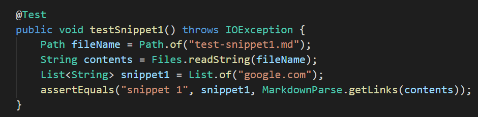
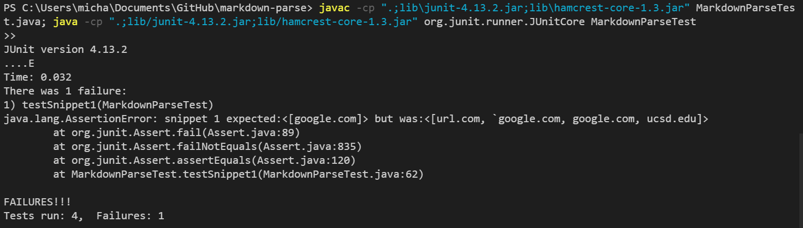
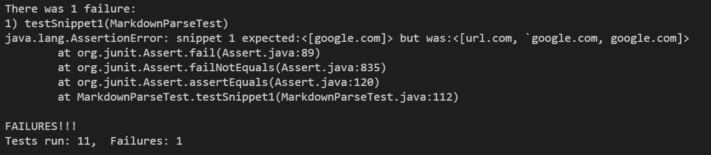
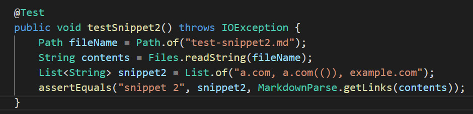
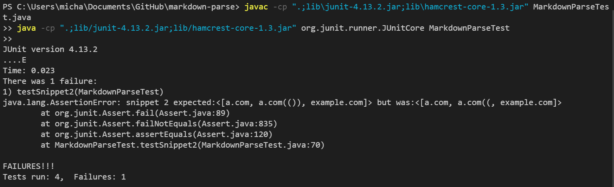
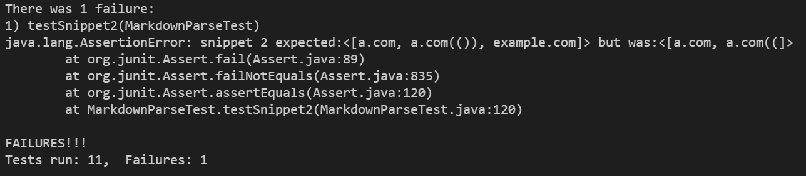
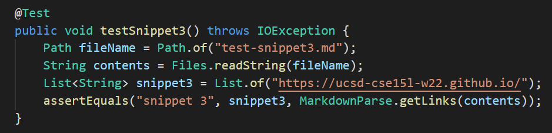
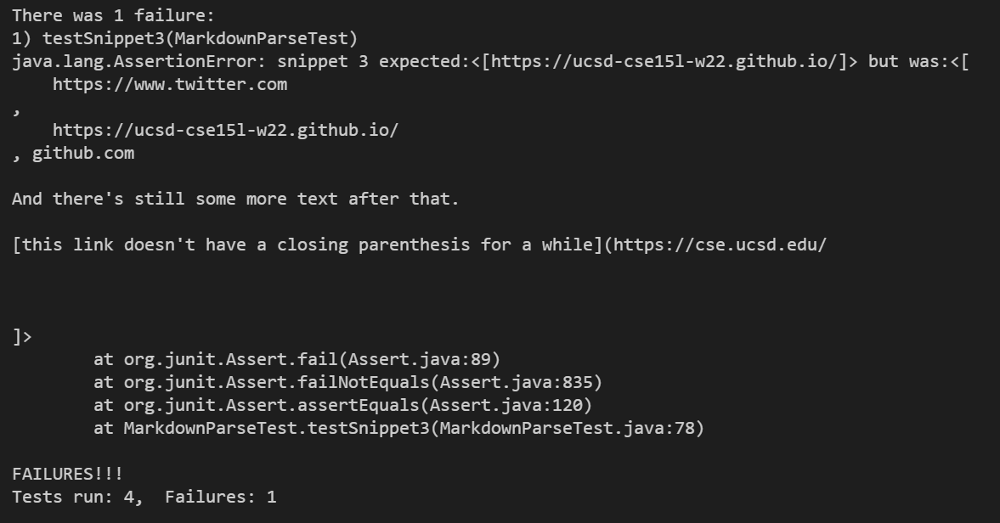
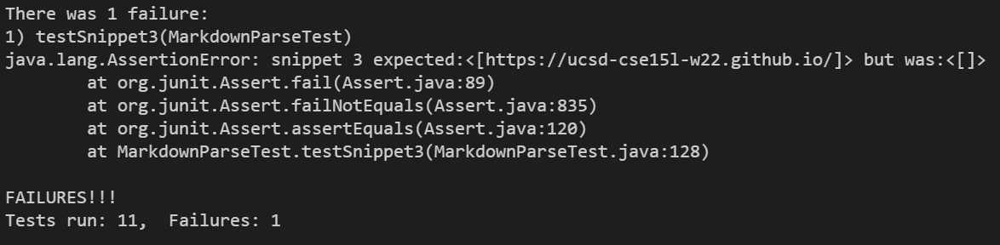

# Lab Report 4 - Week 8

View all my lab reports [here](https://mtang24.github.io/cse15l-lab-reports/)!

---

For reference, these are the `markdown-parse` repositories used:

* [Mine](https://github.com/mtang24/markdown-parse)
* [The other group's](https://github.com/BenX-64/markdown-parse)

## Snippet 1

Using the CommonMark demo site, Snippet 1's code should produce only the second line of text as a link:

[another link](`google.com)`

This means that `[google.com]` should be returned.

To test the output of this link in `markdown-parse`, I created the following test:

In my implementation, the test did not pass:

In the implementation of another group, the test did not pass either:

## Snippet 2

Using the CommonMark demo site, each line of Snippet 2's code should a link. However, the first line of text should only return `a.com` and not `b.com`:

[nested link](a.com)

[a nested parenthesized url](a.com(()))

[some escaped \[ brackets \]](example.com)

This means that `[a.com, a.com(()), example.com]` should be returned.

To test the output of this link in `markdown-parse`, I created the following test:

In my implementation, the test did not pass:

In the implementation of another group, the test did not pass either:

## Snippet 3

Using the CommonMark demo site, Snippet 3's code should produce only the third group of lines of text as a link:

[this title text is really long and takes up more than 
one line](
    https://ucsd-cse15l-w22.github.io/
)

This means that `[https://ucsd-cse15l-w22.github.io/]` should be returned.

To test the output of this link in `markdown-parse`, I created the following test:

In my implementation, the test did not pass:

In the implementation of another group, the test did not pass either:

## Potential Code Changes

For Snippet 1, a small code change I could make so that my program works for all related cases that use inline code with backticks might involve:

* putting an if-statement that searches for backticks ( ` ) using indexOf
    * if any backticks are found within the parentheses, then start nextOpenParen after or nextCloseParen before the backticks
    * if the backticks are found outside of the parentheses or within the link, then they should be ignored

For Snippet 2, a small code change I could make so that my program works for all related cases that nest parentheses, brackets, and escaped brackets might involve:

* adding an if-statement that checks for an open bracket and another one that checks for an open parenthesis using indexOf
    * if there is an open bracket and/or an open parenthesis, then there must be a close bracket and/or close parenthesis
    * otherwise, it cannot be a valid link
    * if there is more than one set of brackets or parentheses, then the program should check that the number of open brackets/parentheses equal to the number of total close brackets/parentheses
    * otherwise, it cannot be a valid link

For Snippet 3, there may not be a small code change I could make so that my program works for all related cases that have newlines in brackets and parentheses.

The previous snippets had additional characters that you could check for more easily (backticks, brackets, parentheses), but Snippet 3 involves varying lengths of newlines and spaces. It is much harder to track this and would probably need more than 10 lines of code. One step to make it easier would probably be to check if there are spaces greater than 2, which would account for these newlines that should not be part of the link.
