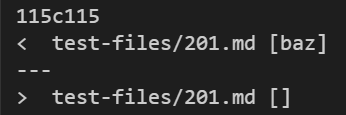
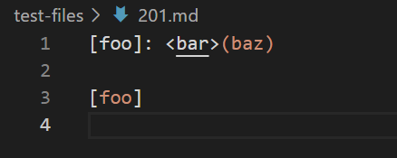
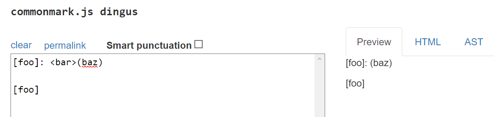
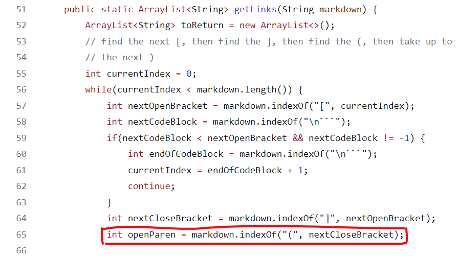

# Lab Report 5 - Week 10

View all my lab reports [here](https://mtang24.github.io/cse15l-lab-reports/)!

---

To find the tests with different results, I used `diff` on the results of running a bash for-loop. Specifically, I did
```
 diff week9/results10.txt myweek9/results10.txt
```
with `week9` being the markdown-parse directory cloned from ieng6, and `myweek9` being my implementation of markdown-parse. 

I stored the results of running `bash script.sh` into results10.txt, and the contents from the getLinks method along with the file name are printed. 

Using the results from `diff`, I can compare the two implementations of markdown-parse.

To determine what should be considered "correct" output, I decided to use the [CommonMark website](https://spec.commonmark.org/dingus/) for consistency.

## Comparison 1
Here is an example of a difference across the two implementations:



The first line indicates the line in results10.txt where the difference occurs. The second line shows that the `week9` implementation (provided) prints out a link for the file, while the fourth line shows that the `myweek9` implementation of markdown-parse (mine) does not print out a link. 

Since I added code to print the file name, I conveniently find that the file involving the difference is the following, `201.md`:



Copying this file and pasting it into the [CommonMark demo website](https://spec.commonmark.org/dingus/), we see that `201.md` should not print out a link and that my markdown-parse implementation (`myweek9`) correctly does this while the provided implementation is incorrect.



Since the first line of `201.md` has a colon, a space, etc. between the close bracket and the open parenthesis, it should not be a link. Taking a look at the provided markdown-parse implementation from week 9, we can see that this isn't taken into consideration. Line 65 from the following code should be fixed so that openParen right after closeBracket, which would be one condition needed for a valid link.




## Comparison 2